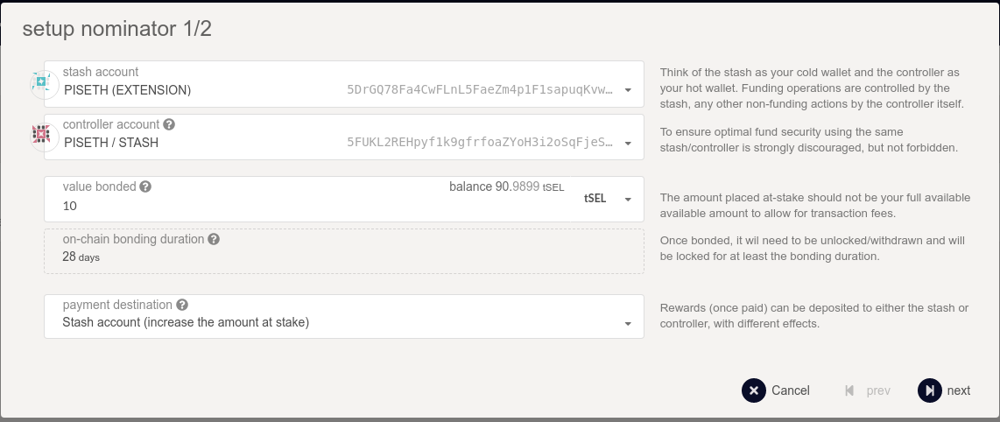
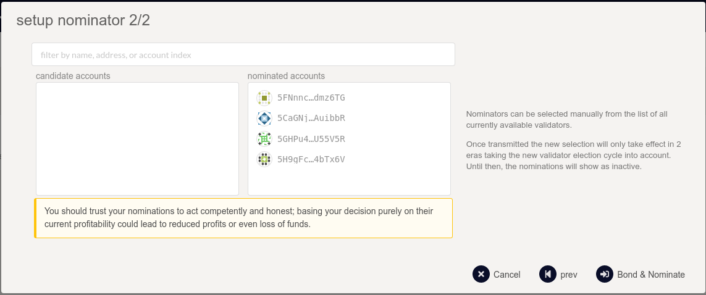

## Be a Nominator (Selendra)
### Introduction
Nominators are participants in the staking system that are responsible for electing good validators for a share in those validators' rewards.

Being a nominator does not require running a node of your own or worrying about online uptime. However, a good nominator performs diligence on the validators that it elects. When looking for validators to nominate, a nominator should pay attention to its own reward percentage for nominating a specific validator - as well as the risk that it bares of being slashed if the validator gets slashed.

### Setting up Stash and Controller keys
Nominators are recommended to set up two separate stash and controller accounts.

You can generate your stash and controller account via any of the recommended methods that are detailed on the [account generation](https://docs.selendra.org/basic/create-account) page.

### Step 1: Bond your tokens
On the [UI of Selendra](https://testnet.selendra.org) navigate to the "Staking" (underneath "Network") tab.

The "Account actions" subsection allows you to stake and nominate.

The "Payouts" subsection allows you to claim rewards from staking.

The "Targets" subsection will help you estimate your earnings and this is where it's good to start picking favorites.

The "Waiting" subsection lists all pending validators that are awaiting more nominations to enter the active validator set.

The "Validator Stats" subsection allows you to query a validator's stash address and see historical charts on era points, elected stake, rewards, and slashes.

Pick "Account actions" underneath "Network" > "Staking", then click the "+ Nominator" button.

You will see a modal window that looks like the below:

Select a "value bonded" that is less than the total amount of SEL you have, so you have some left over to pay transaction fees. Transaction fees are currently at least 0.0001 SEL, but they are dynamic based on a variety of factors including the load of recent blocks.

### Step 2: Nominate a validator

You are now bonded. Being bonded means your tokens are locked and could be slashed if the validators you nominate misbehave. All bonded funds can now be distributed to up to 16 validators. Be careful about the validators you choose since you will be slashed if your validator commits an offence.

Click on "Nominate" on an account you've bonded and you will be presented with another popup asking you to select some validators.

Select them, confirm the transaction, and you're done - you are now nominating. Your nominations will become active in the next era.

### Step 3: Stop nominating

At some point, you might decide to stop nominating one or more validators. You can always change who you're nominating, but you cannot withdraw your tokens unless you unbond them. Detailed instructions are available here (to be updated).