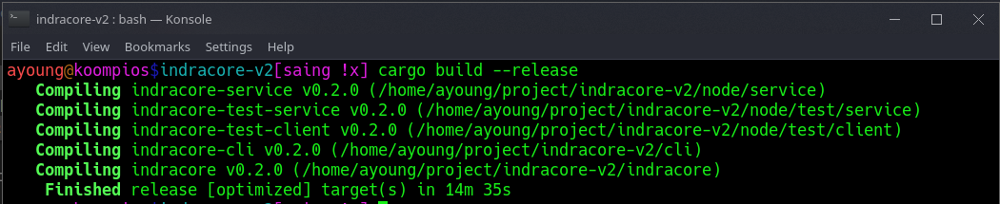
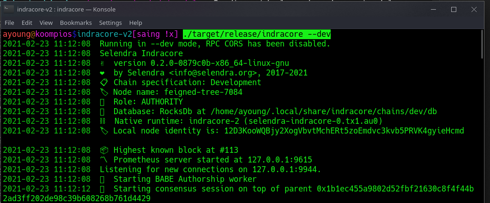
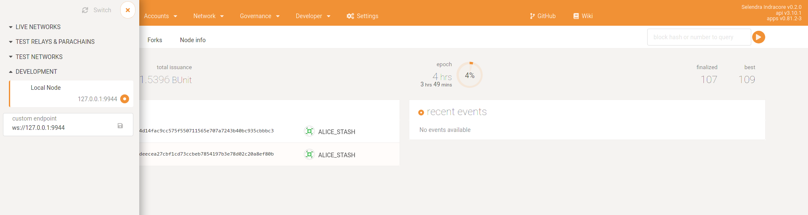
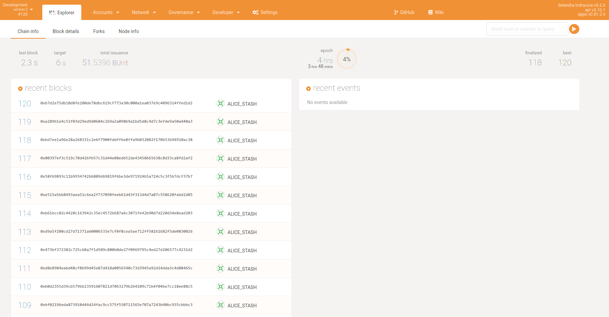
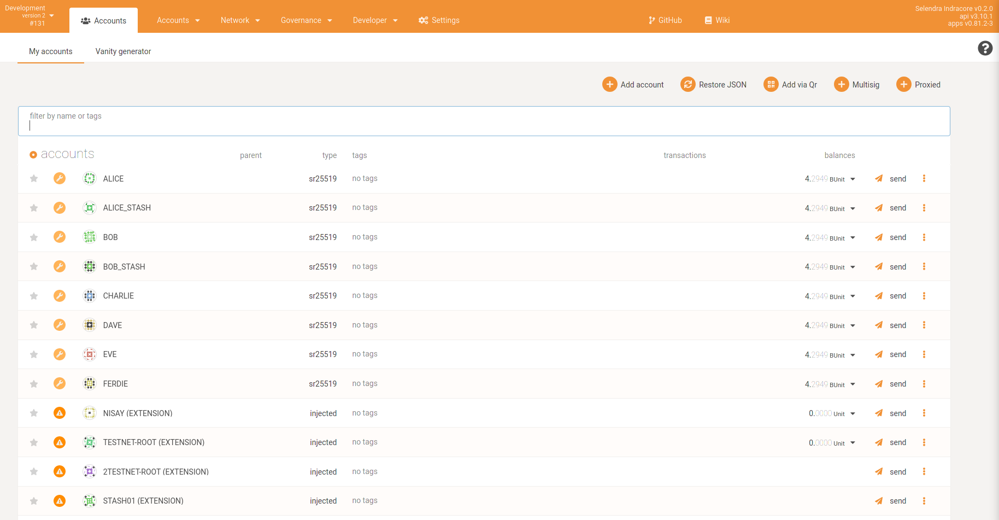

## Setting Up a Indracore Node and Connecting to the Polkadot JS GUI
### Introduction
This guide outlines the steps needed to create a standalone local node for testing of Indracore.

If you follow to the end of this guide, you will have a Indracore node running in your local environment and will be able to connect it to the default Polkadot JS GUI.

### Installation and Setup
We start by cloning the Indracore following repo:

[https://github.com/selendra/indracore](https://github.com/selendra/indracore) page.

```
git clone https://github.com/selendra/indracore.git
```
Next, install Substrate and all its prerequisites (including Rust) by executing:

```
curl https://getsubstrate.io -sSf | bash -s -- --fast
```
Now, lets make some checks (correct version of Rust nightly) with the initialization script:

```
./scripts/init.sh
```
Once you have followed all of the procedures above, it's time to build the standalone node by running:

```
cargo build --release
```
Here is what the tail end of the build output should look like:



Then, you will want to run the node in dev mode using the following command:

```
./target/release/indracore --dev
```
You should see an output that looks like the following, showing that blocks are being produced:



### Connecting Polkadot JS Apps to a Local Indracore Node

On the [UI of Selendra](https://testnet.selendra.org) click on the top left corner to open the menu to configure the networks, and then navigate down to open the Development sub-menu. In there, you will want to toggle the "Local Node" option, which points Polkadot JS Apps to ws://127.0.0.1:9944. Next, select the Switch button, and the site should connect to your Indracore node.



With Polkadot JS Apps connected, you will see the local Indracore node producing blocks.



To check the balance of an address, you can simply go to the Accounts tab. You can find more information in this site.

