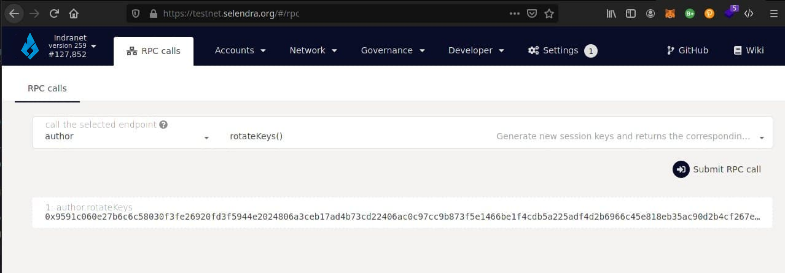

## Run a Validator
### Introduction

Running a validator on a live network is a lot of responsibility! You will be accountable for not only your own stake, but also the stake of your current nominators. If you make a mistake and get slashed, your money and your reputation will be at risk. However, running a validator can also be very rewarding, knowing that you contribute to the security of a decentralized network while growing your stash.

### Initial Set-up
#### Requirements
Provisioning the server with following recommendation:

* OS: Linux x64 recommend Ubuntu 18.04 x64.
* RAM: 2GB or above.
* HDD/SSD: 60GB.

#### Install Rust

```
curl https://sh.rustup.rs -sSf | sh

```
```
rustup update
```
install dependencies
```
sudo apt install make clang pkg-config libssl-dev build-essential
```
Maxos 
```
brew install cmake pkg-config openssl git llvm
```

#### Install & Configure Network Time Protocol (NTP) Client
If you are using Ubuntu 18.04 / 19.04, NTP Client should be installed by default.
```
timedatectl
```
If NTP is installed and running, you should see System clock synchronized: yes
Do not see it, you can install it by executing:
```
sudo apt-get install ntp
```
ntpd will be started automatically after install. You can query ntpd for status information to verify that everything is working:
```
sudo ntpq -p
```

#### Building and Installing the indracore Binary

```
git clone https://github.com/selendra/indracore.git
cd indracore
./scripts/init.sh
cargo build --release
```
You can begin syncing your node by running the following command:
```
./target/release/indracore --pruning=archive --chain sel
```
if you do not want to start in validator mode right away.

The --pruning=archive flag is implied by the --validator and --sentry flags, so it is only required explicitly if you start your node without one of these two options. If you do not set your pruning to archive node, even when not running in validator and sentry mode, you will need to re-sync your database when you switch.

#### Bond SEL
Make sure not to bond all your SEL balance since you will be unable to pay transaction fees from your bonded balance.

It is now time to set up our validator. We will do the following:

Bond the SEL of the Stash account. These SEL will be put at stake for the security of the network and can be slashed.
Select the Controller. This is the account that will decide when to start or stop validating.

First, go to the [Staking](https://testnet.selendra.org/#/staking) section. Click on "Account Actions", and then the "New stake" button.

Once everything is filled in properly, click Bond and sign the transaction with your Stash account.

After a few seconds, you should see an "ExtrinsicSuccess" message. You should now see a new card with all your accounts (note: you may need to refresh the screen). The bonded amount on the right corresponds to the funds bonded by the Stash account.

#### Set Session Keys

Navigate to Toolbox tab and select [RPC Calls](https://testnet.selendra.org/#/rpc) then select the author > rotateKeys() option and remember to save the output that you get back for a later step.


#### Validate
If you go to the "Staking" tab, you will see a list of active validators currently running on the network. At the top of the page, it shows how many validator slots are available as well as how many nodes have signaled their intention to be a validator. You can also go to the "Waiting" tab to double check to see whether your node is listed there.