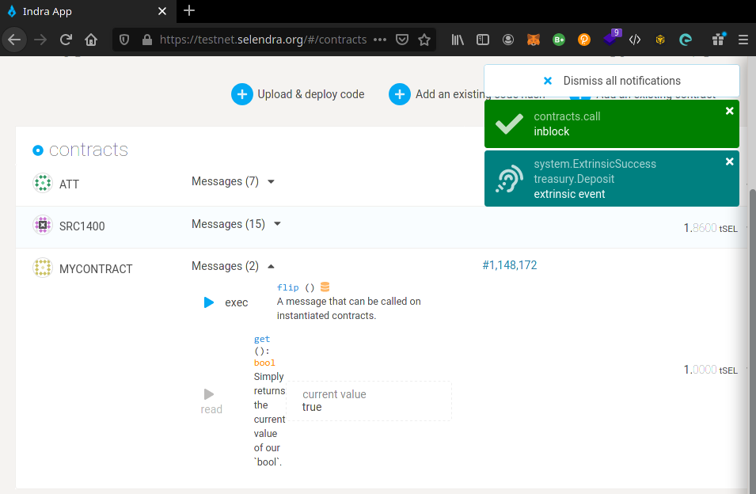

### Calling Your Contract

### Smart contract messages

To communicate with Smart contracts, we use Messages:

It's possible to pass two kinds of messages:
- messages change a Smart contract's state is sent as transactions
- messages that do not change the state is called by RPC calls.

Let's try to read our Smart contract value by `get()` message call.

 value")

Second, let's change a Smart contract state by sending a "message", send flip() message that flips Smart contract to boolean flag.

Verify the result:

Using these two kinds of messages, your DApp can be easily read and written the Smart contract data.

### We Want to Hear From You

If you have any feedback regarding deploying Smart contract on your project, feel free to contact us via our Telegram group [here](https://t.me/selendraorg).
