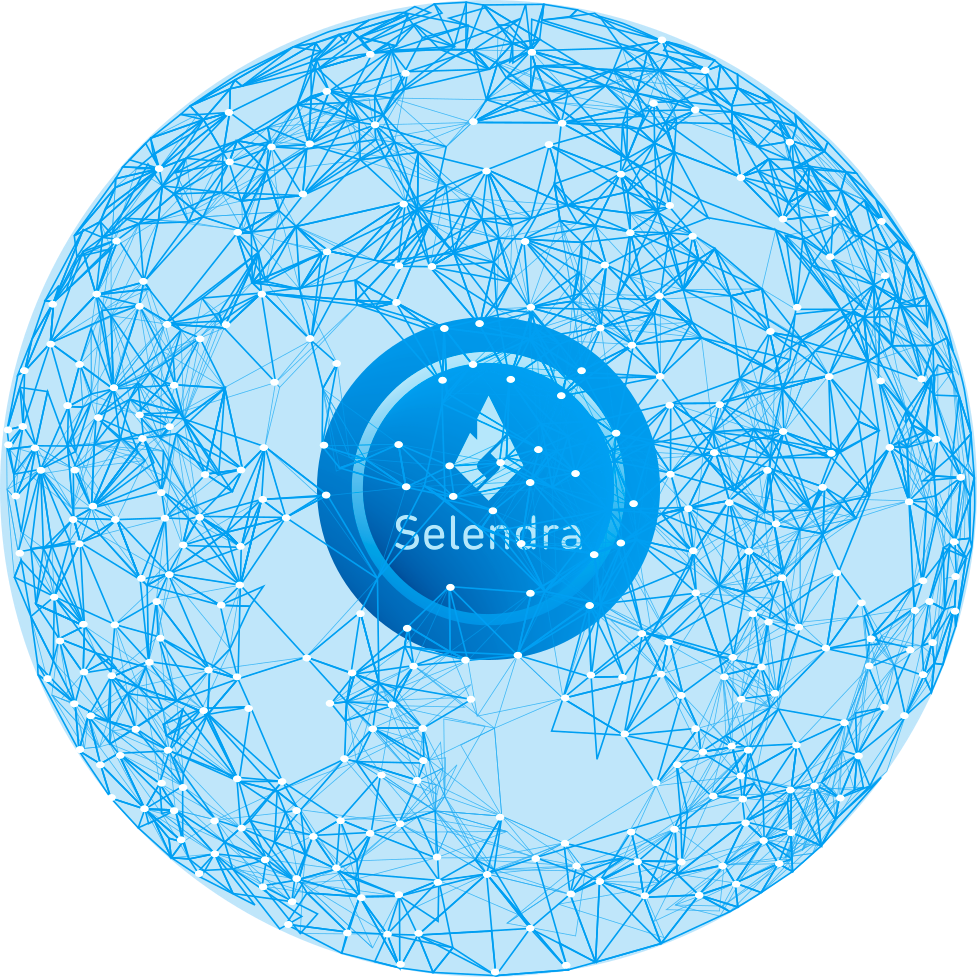

### **Potential Use Cases**

With the advent of blockchain technology in general, modern man has crossed a next-generation digital threshold, with business application opportunities abounding for young, progressive entrepreneur developers on the cutting edge of this technology. The Selendra Blockchain Network provides exciting, new, practical solutions for:

- Decentralized e-commerce applications
- Asset tokenization distribution and management
- Identity management
- Financial inclusion
- Insurance
- Decentralized computing and storage
- Internet of Things (IoT) applications
- Gaming applications
- Music and arts industry
- Decentralized autonomous organization (DAO)
and much more

**Use case scenarios in finance, commerce, and asset tokenization:**

1. Shares of ownership in business and enterprise, along with shareholder trades and dividend payouts are better managed through blockchain tokenization than through traditional accounting methods.

    Business entities presently forming under *SmallWorld Venture Ltd*. will be among the first to be implementing a tokenizen asset and management system. We see asset tokenization as a revolutionary new technology that will forever change modern digital trade and management systems. 
 
2. Tokenized investment pools are for investors large and small with a common goal. The traditional investment landscape is changing where any investment asset can be tokenized, while investment pools can invest in almost any asset. *Security Token Offering*(STO) and tokenized special interest investment pools offer transparency, fractional ownership, and trading on secondary markets.

    At present, the Selendra team is developing a blockchain asset tokenization and management model which will be used to govern the investment pool of 30 investors. A custom token built on a Selendra network sub-chain will represent the group while the assets will be held and traded through the *Bitriel Wallet*.

3. [BitrielSwap](https://dapp.bitriel.com) is a planned decentralized token exchange for the Selendra network where issued tokens which are not traded on a major exchange may be traded against other hosted token projects thereby opening up liquidity options. The BitrielSwap exchange will be integrated into the *Bitriel Wallet* and will allow for trading and fundraising options within the wallet on a secondary market.

4. [VitaminAir](https://vitaminair.org/) is a catalyst for a global movement to reforest the rainforest and regenerate our ecosystem through platforms and models that incorporate technology and designs inspired by nature. In the process, we're growing a community of people engaging in social, cultural, ecological and economic regeneration.

    *VitaminAir* will tokenize 30 hectares of farmland and farmland production where anyone can legally and safely incrementally invest in real estate.  Invested funds are applied toward land, farm and community development, including the acquisition of additional hectares.

5. **Albazaar Marketplace** is a planned virtual marketplace where goods and services can be exchanged through smart contracts in a peer-to-peer network, together with all the other added benefits blockchain technology has to offer. Buyers and sellers are empowered through the community where transactions can be negotiated with confidence.

6. **Village Fi-Fi**, a hotspot mesh network with local contents cached that provides internet access to villagers, one village at a time. Mesh networks offer options for local internet that help bring down the cost of data. Incentives users to browse useful contents or relative ads, while internet fees are paid via RISE or SEL.

7. [SALA KOOMPI](https://sala.koompi.com), a virtual school that incentivized teachers to create good quality video contents and students to fairly rate the cause they learned. Anyone can open a school, similar to a personal Facebook page, but focus on video education. SALA KOOMPI believes that anyone has some good to share and enlighten the world, if incentives are fairly and openly distributed.

8. **Decentralized Autonomous Organization (DAO)**

    Selendra Foundation will be the first of many Decentralized Autonomous Organization (DAO) projects to operate within the Selendra Network, and will serve as a prototype. The Selendra DAO will manage the allocated 10 percent foundation reserve, and will be used to fund additional projects to grow the Selendra network.

9. **Plant your change: Stake your Trees and Transactions** 
    In the near future, millions of transactions will be conducted through the Selendra network. Selendra wants to represent these transactions by planting one tree for every 100 transactions. 

    Imagine a community harmoniously supporting a 10x sustainable adoption of blockchain technology with the environment. Selendra wants to be part of that change and commit from the start to fund tree planting and forest conservation.

    A baseline from the New England Forest Dept estimates that 3,000 trees per hectare need to be planted. Our goal over the next 20 years is to plant 700,000,000 trees covering nearly 250,000 hectares. Together we can make a difference. 

