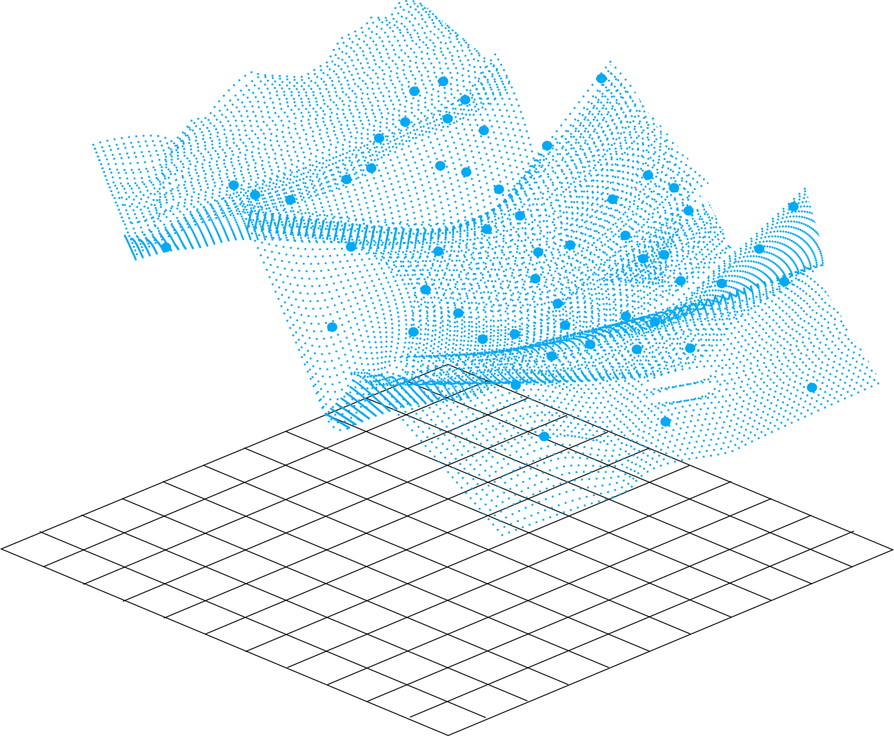
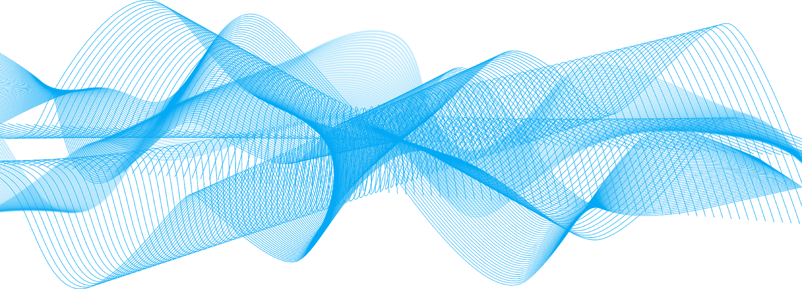

### **Selendra Architecture**

### A. Architecture: General Overview

The Selendra Network is built upon the Polkadot Substrate framework, a diversified multi-chain architecture focused on interoperability and ease of development, allowing greater opportunity for early developers to build their own private networks.

Selendra architecture provides for a shared, distributed, decentralized, immutable ledger that facilitates the process of recording transactions and tracking assets in a peer-to-peer digital network through providing smart contract services which generate transactions on the blockchain network.

SeIendra architecture is an extensible, modular, open-source framework with multi-sharding capabilities. Sharding is a database partitioning technique which allows for the deployment of parallel blockchains, or para-chain networks, which are bridged to operate alongside Selendra's main blockchain environment, enabling scalability, faster processing, and reduced network latency.  

Selendra para-chains allow developers ease and freedom to build their own unique blockchain applications in parallel with the Selendra network, effectively running sub-networks under a Selendra framework.

### B. Architecture: Forkless Upgrades

As with all software, to remain timely, useful and relevant, blockchain software requires upgrades for continued development.  Early generation blockchain upgrades required forking, a process requiring weeks, if not months to deploy. 

Upgrades through the forking process can become controversial, sometimes leading to a hard fork, which in essence splits the development community in two. Selendra employs forkless upgrades enacted through an on-chain governance system, thereby creating enhanced stability through avoiding the forked upgrade process altogether.

### C. Architecture: Consensus Roles

Selendra has four distinct roles for reaching consensus:
1. ***Validators*** secure the network through the process of staking, validating proofs from collators, and through participating in consensus with other validators.
1. ***Collators*** maintain data shards by collecting shard transactions and producing proofs for validators. They also monitor the network and report abuse to validators.
1. ***Nominators*** secure the network by selecting trustworthy validators and stakers.
1. ***Fishermen*** monitor the network and report abuse to validators.

### D. Architecture: Governance Roles

Selendra uses a governance mechanism of two distinct committee types that ensure the majority of stakeholders will always secure the network.

1. ***Holders Council committees*** are elected to represent passive stakeholders in two primary governance roles, which are proposing referenda, and vetoing dangerous or malicious referenda.
1. ***Technical committees*** are composed of active Selendra developers who propose emergency referenda and new features together with the Holders Council for fast-tracked voting and implementation.

### E. Architecture: Rewards
 
Selendra is a ***Nominated Proof of Stake*** blockchain that incentivizes decentralization to maximize chain security through two primary role mechanisms, that of ***validators*** and ***nominators***.
 
Validators with greater stakes tend to have more resources for maintaining infrastructure, therefore, validator rewards are paid the same regardless of stake level. Generally, validators with lesser stake levels will pay more to nominators, whereby nominators have an economic incentive to shift toward lower stake validators, resulting in more evenly distributed stakes across validators and avoiding concentrations of power. 

### F. Architecture: Transaction Fees

Transaction fees are among the greatest barriers hindering mainstream adoption. Selendra’s approach to this issue is to make transaction fees fixed and very low from the start. Selendra transaction fees are fixed at 0.00001 SEL per transaction. Since the cost per transaction is fixed to the SEL token, the cost per transaction will only vary relative to the SEL token price.  

For example, assuming 1 SEL token is initially valued at 0.025 USD, the chart below demonstrates transaction fee variations as the price of a Selendra (SEL) token increases in price.

|$ Price/SEL | USD per Transaction | # of transaction/USD |  
| :-----: | :----------: | :------: |
| $0.025  |  0.00000025  |  4.000.000| 
| $0.250  |  0.00000250  |  400.000| 
| $2.500  |  0.00002500  |  40.000| 
| $5.000  |  0.00005000  |  20.000| 

Comparatively within the greater blockchain community, Selendra transaction fees are very low, and will always remain low, even with significant increases in the Selendra (SEL) token price as the above chart illustrates.

Long-term low and stable transaction fees allow developers and the community to be more experimental with application development and usage, thereby encouraging innovative development and activity on the network, especially with regard to the deployment of private para-chain applications, bringing greater overall value to the network. 

Network governance bodies such as validators, norminator, collators and fishermen are rewarded through the staking process, with 30% of transaction fees being paid as rebates, while the remaining 70% are taken out of existence.

### G. Architecture: Network Abuse Mitigation

As Selendra transaction fees are inherently low, the possibility of attack on computing resources is a possibility. To mitigate this issue, prior to performing any transaction, Selendra account holders must maintain a minimum balance of 0.10 SEL (this minimum balance amount will be adjusted accordingly as the network develops).

A minimum balance deposit is used to deter network attacks, where the deposit is forfeited upon detection of network abuse. Forfeited deposits are added to the reward pool fund for future payments to validators and other network participants.

