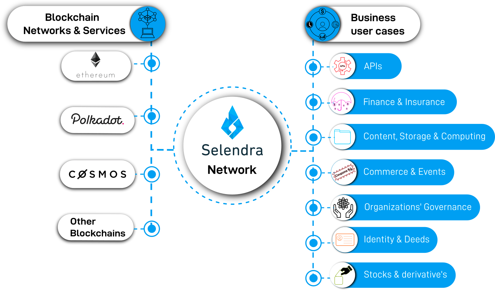

### **Selendra Benefits**
At present, blockchain application development and mainstream user adoption are hindered by the fact that diverse blockchain networks cannot share data outside its own native chain. In addition, network fees become excessive as native token value increases.

While attempts have been made toward solving these issues, solutions thus far have been out of reach for upstart developers. New applications are difficult to develop and deploy, while being incompatible with existing data and network applications. 

Blockchain technology is indifferent to first generation Internet office and ecommerce applications, and there is no single blockchain network capable of solving all potential application needs. Instead, several different blockchain projects working together are necessary, each solving specific problems according to design.

Selendra is designed upon a philosophy of openness and connectivity, acting as a gateway to other blockchain networks, resulting in an extended range of new business use-cases. 

The Selendra community benefits through receiving access to a broad range of services available within a single user-friendly development environment that is compatible with Ethereum, Polkadot, Cosmos, other blockchain networks, and non-native network nodes. 
