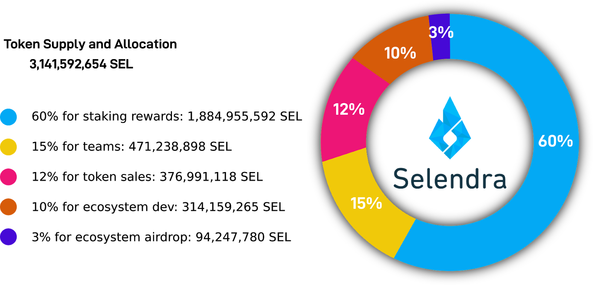

### **Selendra Tokenization Structure**

Selendra offers a dual token program; the utility token (SEL), and the stable token (RISE). SEL is primarily used for business and ecosystem application development, while RISE  is primarily used for payments. 

### A. The SEL Utility Token,  Supply and Allocation

SEL is Selendra's native utility token which is used for:
-  payments for processing transactions and data storage
- staking rewards for network validator nodes
- tallying governance votes for determining network resource allocations

The SEL utility token is crucial for processing transactions and storing data, together with maintaining network security while fostering good governance and growth. Selendra tokens are distributed among five major participating groups within the network as allocated and written in the genesis block. 

Each allocation group is critical to the network’s creation, infrastructure, development, and growth:

- 60% for Selendra mining block rewards over 20 years, released decrementally every 3 years after the main launch (see detailed release schedule). Rewarded to validators, collators, nominators, fishermen, and service nodes for securing, providing storage, maintaining the blockchain, and running contracts.

- 15% genesis allocation to Selendra teams with 15 year, 1% per year linear incremental vesting beginning 2 years after main launch. For research, engineering, deployment, business development, and marketing. 

- 12% genesis allocation for investors with 6 month to 3 years linear vesting. For funding network development, business development, partnerships, and support community.

- 10% genesis allocation for the Selendra Foundation with a 10 years linear distribution. For long-term network governance, partnership support, public works, community building, and grants.

- 3% genesis allocation for airdrops with a 4.5 year linear distribution. A seed for broader communities who otherwise wouldn’t have a chance to participate in the distribution.
