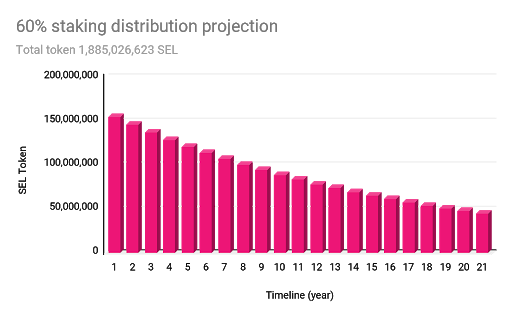
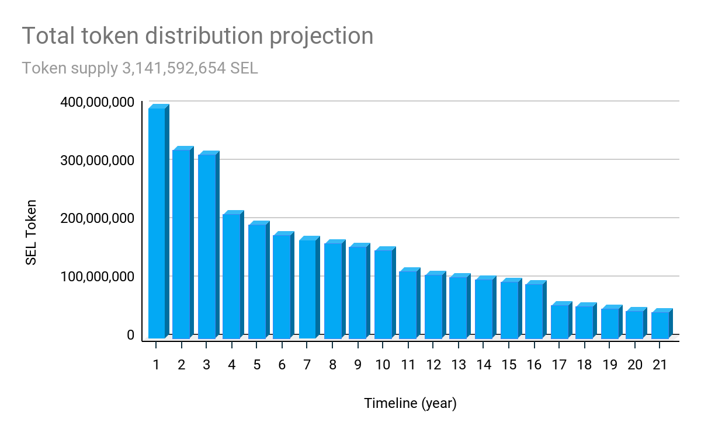

### **Staking Rewards Release Schedule**

Whereas Bitcoin uses a half-life model every 4 years, Selendra (SEL) staking reward releases are distributed according to a declining 6% annual payout.

As per the graph below, during the first year of the initial network launch, approximately 5% of total staking rewards are released. During each of the following years, for the next 20 years, there will be an approximate 5 to 6% decrease in rewards payable from year to year until all rewards are distributed. 

In the advancing world of blockchain application development, as our reward distribution cycle reaches full maturity, the Selendra reward schedule lays a solid foundation for first generation stakers and developers while continuing to reward the next generation. Selendra's graduated decremental release method offers greater fairness for later-stage next-generation entrants as well as for early developers and stakers. 

