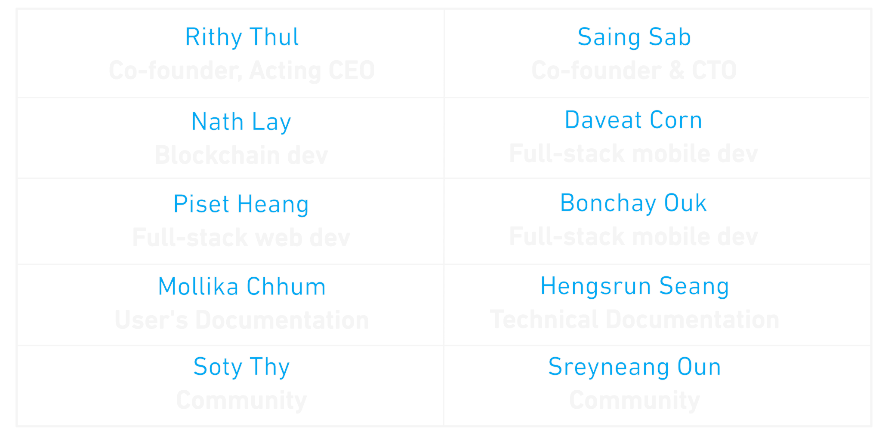

### **Team**
Selendra is the brainchild of SmallWorld Venture, a venture seed funder based in Phnom Penh, Cambodia. SmallWorld Venture began in 2011 by providing a collaborative workspace for entrepreneurs and startups.

Selendra has been in research and development since 2015 by a group of young technology enthusiasts that joined the SmallWorld Venture community.

This team is a self-taught, peer-to-peer community that learned to build real-world applications and products useful for users in emerging markets. The Selendra development team grew out of this community. 

Our team brings a wealth of experience, dedication and passion for creating a user-friendly blockchain network that will add value to everyone's lives. The goal is to create an easy, fun, and valuable network for local and global users.

### Harmony with nature 

The team loves integrating technology products with nature to create a sustainable product that can benefit everyone. In June 2021, our core development members will relocate to VitaminAir, a jungle office 110km outside of Phnom Penh city, living off the land while creating sustainable agriculture and forestry programs powered by technology. 

### Guiding Principles

To develop and grow Selendra, our team has designed principles to develop the
project. 

1. Surround ourselves with inspiration, real-world problems and our stakeholders. 
1. Take the long term view on projects
1. Open framework for utilizing diverse disciplines and perspectives 
1. Aim for 10x, not 10%
1. Fall in love with the problem, not the solution. 

**Selendra is crafted and built by these friendly folks.** 

<!-- |Rithy Thul | Saing Sab | Nath Lay | Daveat Corn |
| :-----:   | :--------:| :------: | :---------: |
| Co-founder, Acting CEO |  Co-founder & CTO |  Blockchain dev| Fullstack mobile dev |
|**Piset Heang**| **Bonchay Ouk** |**Mollika Chum** | **Hengsrun Seang** |
| *Co-founder, Acting CEO* |  Co-founder & CTO |  Blockchain dev| Fullstack mobile dev | -->

