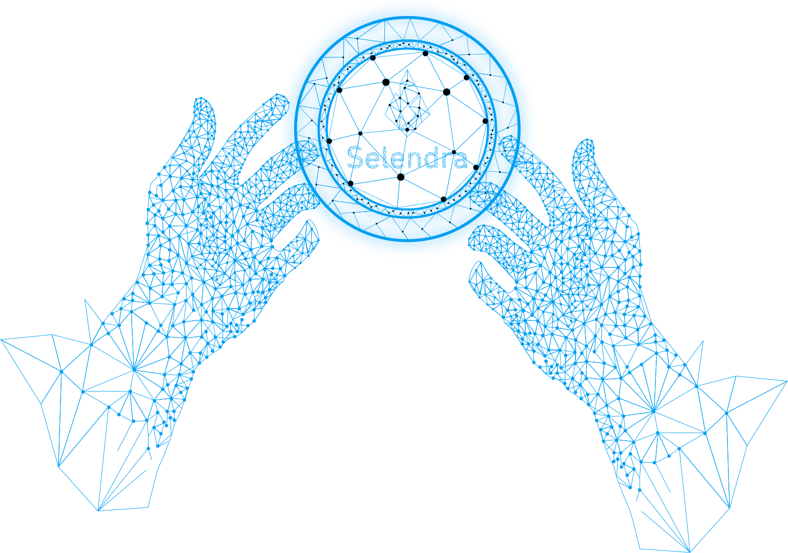

### Token Sales and Vesting Schedules
**A. Introduction**

Selendra token investors come in all sizes, both large and small, a globally diverse group of forward thinkers with interests in business, economics, and blockchain network development. 

To embark on any ambitious project, initial seed capital is often needed, and initial token sales to early-stage investors help provide this necessary start-up capital. Accordingly, we seek a broad range of token investors from a variety of industries, groups and organizations.  

**B. Vesting: Token Sales and Discounts**

Selendra token sales will take place in four sessions. Each session will help onboard a broader circle of investors and developers into the network. The vesting token sales schedule is as follows:
- Aug - Dec 31st 2021    : private-sale & pre-sale up to 3%
- Jan 2022               : IDO and DEX Listing 

Instead of requiring long-term vesting schedules, investors are rewarded with purchase discounts while providing multiple options for different risk profiles. Such vesting purchase discounts create long-term project alignment, and serve as a powerful incentive for early network development.

**C.    Vesting: Strategic Advisors**

Strategic Advisors are individuals and organizations who have made a strong and significant long-term commitment toward the growth and development of the Selendra network, while receiving the potential for reward.

Initial token sales to Strategic Advisor investors are offered with a graduated discount schedule, rewarding early-stage investors who are willing to accept the risks involved toward building the network. 

Strategic Advisors are offered vesting choices of 1 to 3 years at discounts of 10 to 30 percent, with a minimum vesting schedule of one year and 10,000 USD, or an equivalent amount in other redeemable crypto assets.   

With a 10,000 USD investment, prior to discount, initial token sales are valued at 0.025 USD/SEL for a token amount of 400,000 SEL.

- 6 mo vesting    : no discount (public sale)
- 1 yr vesting    : 10% discount (minimum presale)
- 2 yr vesting    : 20% discount
- 3 yr vesting    : 30% discount

**D. Vesting: Selendra development teams**
    
Selendra development teams bring a long-term commitment toward building a strong network for mainstream users, next generation developers, token investors, and other network participants. Selendra development teams are rewarded through a linear vesting model over a 15 year period, receiving rewards of 1 percent per year commencing two years after initial network launch.

**E. Vesting: Selendra Foundation**

The Selendra Foundation's role is to support developers, educators, community builders from  all walks of life to bring value-added to the Selendra network.  The foundation has in reserve a 10 percent total reward pool to be distributed at a rate of up to one percent per year over the span of ten years with payouts commencing after the initial launch.

**F. Vesting: Stakers & Validators**

Sixty percent of all tokens are held in reserve for the reward pool is gradually distributed to stakers and validators over a span of 20 years. During the first 6 years after launch, 45 percent of this reward pool will be distributed.  After 20 years of network development, when the reserve reward pool depletes itself, transaction frequency and amounts will have risen sufficiently to provide adequate revenue generation for validators and stakers through transaction fees and tips alone.

