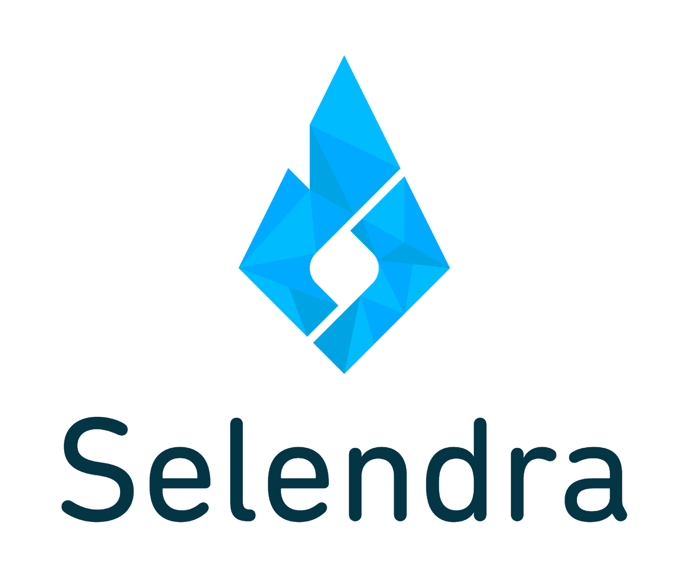

<!--  -->

# Table of Contents
### [1. Introduction](introduction-to-selendra.md)
### [2. Blockchain - A General Overview](blockchain-general-overview.md)
### [3. Selendra Benefits](selendra-benefits.md)
### [4. Selendra Architecture](selendra-architecture.md)
### [5. Selendra Tokenization Structure](selendra-tokenization-structure.md)
### [6. Staking Rewards Release Schedule](staking-rewards-release-schedule.md)
### [7. Token Sales and Vesting Schedules](token-sales-and-vesting-schedules.md)
### [8. Potential Use Cases](potential-use-cases.md)
### [9. Roadmap](roadmap.md)
### [10. References](reference.md)
---
## PDF Documents
### [Selendra Tokenomic Paper](token-economics.html) 
### [Selendra Token Sale](token-sale.html)
<!-- ---

### [10. Team](team.md)
### [11. Frequently Asked Questions](../Faqs/faqs.md)

LEGAL DISCLAIMER: This document describes various aspects of the Selendra Blockchain Network. Updates to this document will be posted on the Selendra github (github.com/selendra) and the Selendra Telegram channel (t.me/selendrachainofficial). This document contains forward-looking statements which are subject to risks and uncertainties that may result in a loss of investment capital. Always give thoughtful consideration using due diligence when investing.
