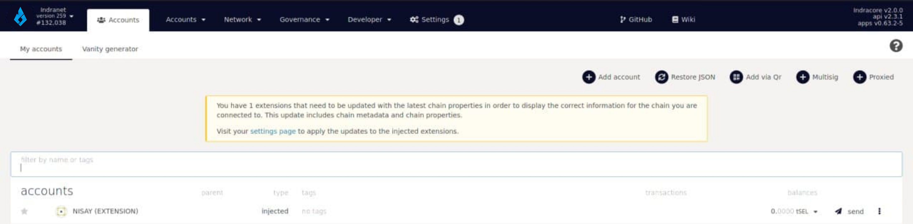
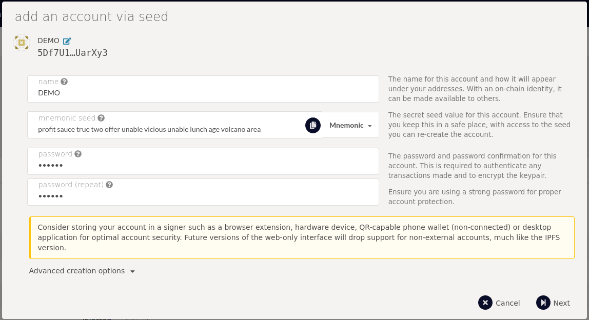
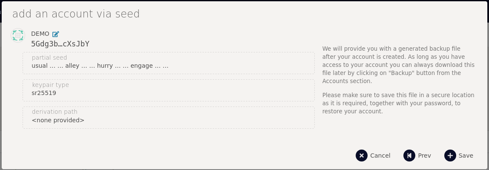

### Create Account On Selendra

This method involves using the [Indra App based](https://testnet.selendra.org) on Polkadot UI and the Polkadot.js browser extension.

#### Create Account Using Indra Apps
Navigate to our [Indra Apps](https://testnet.selendra.org) and go to Account tab.

Click Add Account.

- Name: The name for this account and how it will appear under your addresses. With an on-chain identity, it can be made available to others.
- Mnemonic: The secret seed value for this account. Ensure that you keep this in a safe place because access to the seed will allow you to re-create the account.
- Password: The password and password confirmation for this account. This is required to authenticate any transactions made and to encrypt the keypair.

Click Next.

Save your copy backup account file.