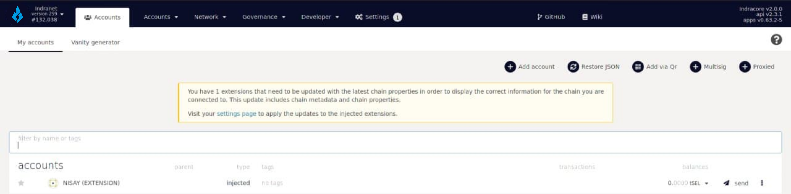

### Send SEL

This method involves using the [Indra App based](https://testnet.selendra.org) on Polkadot UI and the Polkadot.js browser extension.

#### Prerequire :
- Selendra account
- Polkadot.js to your browser and connected your wallet
- Some testnet or mainnet SEL to send

Visit the [Indra App based](https://testnet.selendra.org). Once connected, click the Accounts tab in the left sidebar, or go directly to the Transfer tab.

In the Accounts tab, click the send button in the row of the account from which you want to send.

Next, confirm the accounts you want to send from and send to, using the address fields. You can delete the information in the 'send to address' to enter in any recipient address, or utilize the dropdown to send between your own connected accounts in your Polkadot.js wallet.

Once the amount is entered and all the information is reviewed and confirmed (consider cryptocurrency transactions as irreversible, so be careful,) click "Make Transfer."

You will see a screen similar to this next, where you can see you transaction fees, can include a tip to the validator who authors the block for faster processing of the transaction (uncommon), and otherwise confirm sending by signing the transaction.

Advanced: You can also pre-sign but not submit this transaction to the network (uncommon) by using the bottom left 'Sign and Submit' toggle and entering a nonce and a duration for the validity of the signed transaction.

Once you hit sign and submit, your Polkadot.js browser extension will open a popup for your account password for the 'send from' account, and you will sign the transaction from your wallet.

Once you sign the transaction, the network receives it and you are done. You can explore the transaction details through a block explorer.